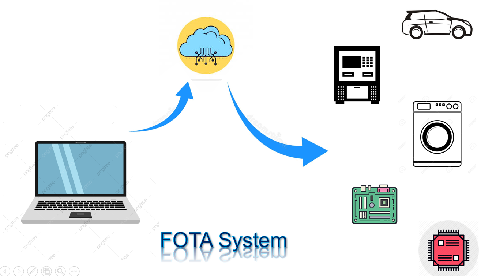
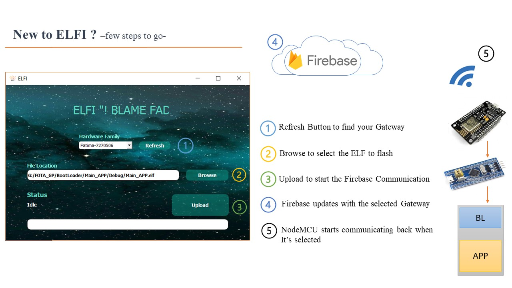
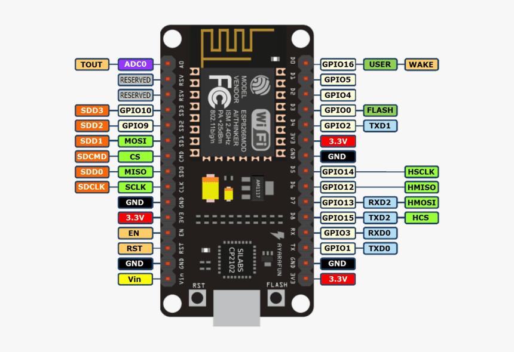
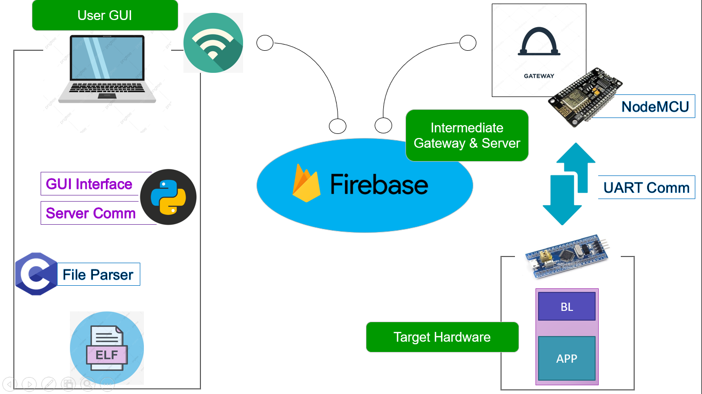

# ELFI - FOTA

  <b> Firmware Over the air Platform Project </b>

  

This Repository is the FOTA Graduation Project for Information Technology Institute (ITI) Diploma (Intake 40) Team:

### Team Members

- **Donia Mohammed Mahmoud Nasr**
- **Esraa Mansour Mohammed Hussien**
- **Fatma Gomaa Mohammed AbdRabo**
- **May Mohammed AbdelSalam Dawoud**
- **Mohamed Adel Anis Ahmed**
- **Mostafa Mohammed Ramdan Kandel** 

## Contents
- [Introduction](#introduction)
- [Project Description](#project-description)
- [Project Overview](#project-overview)
  - [User GUI](#user-gui)
  - [Intermediate Gateway and Server](#intermediate-gateway-and-server)
  - [Target Hardware Firmware (Bootloader)](#target-hardware-firmware-bootloader)
- [Project Phases](#project-phases)
- [Overall Project Design](#overall-project-design)
- [Future Enhancements](#future-enhancements)
  
## Introduction

* Many embedded systems are deployed in places that are difficult or impractical for a human operator to access. This is especially true for Internet of Things (IoT) applications, which are typically deployed in larger quantities and with limited battery life. Some examples would be embedded systems that monitor the health of a person or a machine. 

* These challenges, coupled with the rapid software lifecycle, cause many systems to require support for over-the-air (OTA) updates.An OTA update replaces the software on the microcontroller or microprocessor of the embedded system with new software.

  

## Project Description

The Project is mainly targeting to upgrade the firmware of remote Hardware ECUs OTA (Over the air). The project is an initalization phase to create a portable, configurable platform to update remotely ECUs with different methods and Hardware. 

## Project Overview

The Project is divided into 3 main Parts:
1. **User GUI**
2. **Intermediate Gateway and Server**
3. **Target Hardware Firmware (Bootloader)**

### User GUI

  

* The User GUI is a friendly user interface with Cool Graphics and Informative layout that enables the user to upload and setup his file that needs to be uploaded on the remote hardware and let him knows the current status of the upload process, and if an error happens, a message will appear why the system has encountered an error to let the user know what to do to solve the problem.

* The Core of User GUI consists of several coded files by Python, C ,and C++. these files are used inside of the GUI to Parse the targeted file (ex: ELF file), Construct The Transmittion protocol ,and Establishing the connection with the intermediate Server.  

* More about our latest [GUI](https://github.com/FatmaGomaa/FOTA_GP/tree/master/2-OTA_Flashing/GUI)

### Intermediate Gateway and Server

  
  <d align="right">
  
</d>

* In order to Communicate to Remote Target, A Public (or local Server) is needed to communicate through it. Firebase is the chosen Server in our project to be used as intermediate server because of its realiability and its database is realtime.

* An intermediate Gateway ECU is needed to be used to Communicate Through Firebase. NodeMCU is our Gateway that through it, we can get the data from the Server and send it to our selected Target (ECU) through a communication protocol (ex: UART)

* More about our latest Intermediate Gateway & Server interfacing [Intermediate NodeMCU & Server](https://github.com/FatmaGomaa/FOTA_GP/tree/master/2-OTA_Flashing/Gateway_Node).

### Target Hardware Firmware (Bootloader)

* The Remote Hardware that needed to be updated with new Fireware, needs to already have a firmware to receive the updated file and flash it on the Hardware ROM. this Firmware called **Bootloader** in which contains Transmission protocol, communication protocol and Flashing Sequence.

* The Bootloader Firmware is Targeted depended which means every Family of ECU needs a standalone Bootloader.

* More about our latest [Bootloader](https://github.com/FatmaGomaa/FOTA_GP/tree/master/2-OTA_Flashing).

## Project Phases

The project includes Three Phases:

1. [First Phase](https://github.com/FatmaGomaa/FOTA_GP/tree/master/1-Wired_Flashing) contains:
   1. Design Overall System View.
   2. Design and Implement transmission protocol.
   3. Design and Implement primitive Bootloader (Flash one Program if there is no another application).
   4. Wired UART communication protocol with PC (NO GUI - Cmd).

2. Second Phase contains:
   1. Transfer the system to be Wirless using NoduMCU and Firebase Server
   2. Upgrade the GUI interface and functionality to deal with the Firebase Server.
   3. Flash First Program Wirelessly.
   
3. [Third Phase](https://github.com/FatmaGomaa/FOTA_GP/tree/master/2-OTA_Flashing) contains:
   1. Enhance the Overall System Functionality and Speed (from 10 min to 40 sec).
   2. Creating Executable GUI that doesn't need any dependencies. 

## Overall Project Design

  

## Future Enhancements

   1. Upgrade the Communication protocol between NodeMCU and Target Hardware (STM) to a higher speed communication protocol (Ex: CAN - LIN - SPI).
   2. Applying a CyberSecurity protocols to the Communication between the PC and The Target Hardware.
   3. NoduMcu be able to be connected to Multiple Targets and register them all on the Network.
   4. Creating a Broadcast Mode to upload the same Program on all nodes on the System (ex: Swarm robotics).
